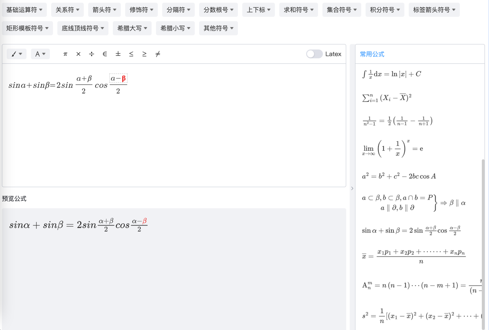
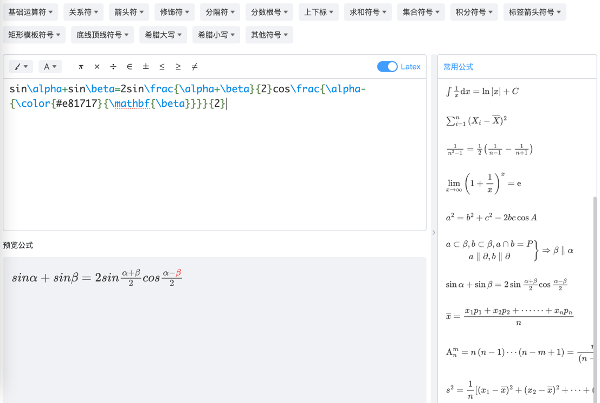
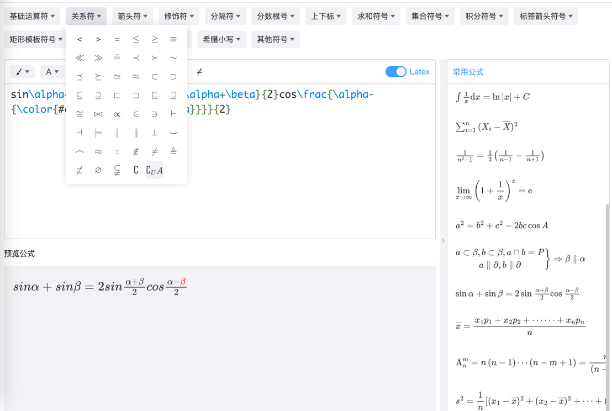
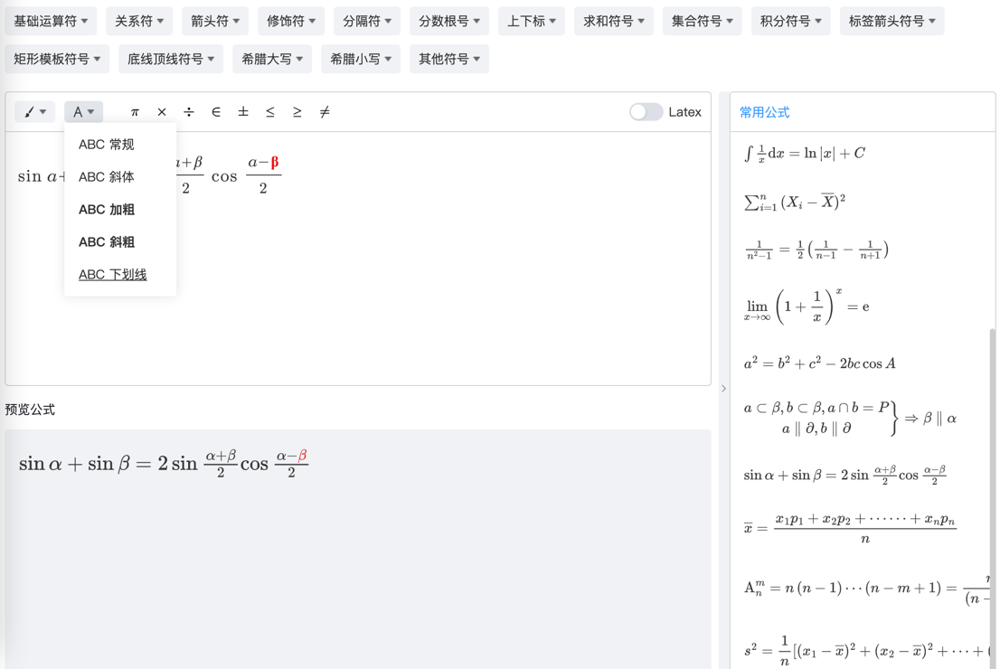
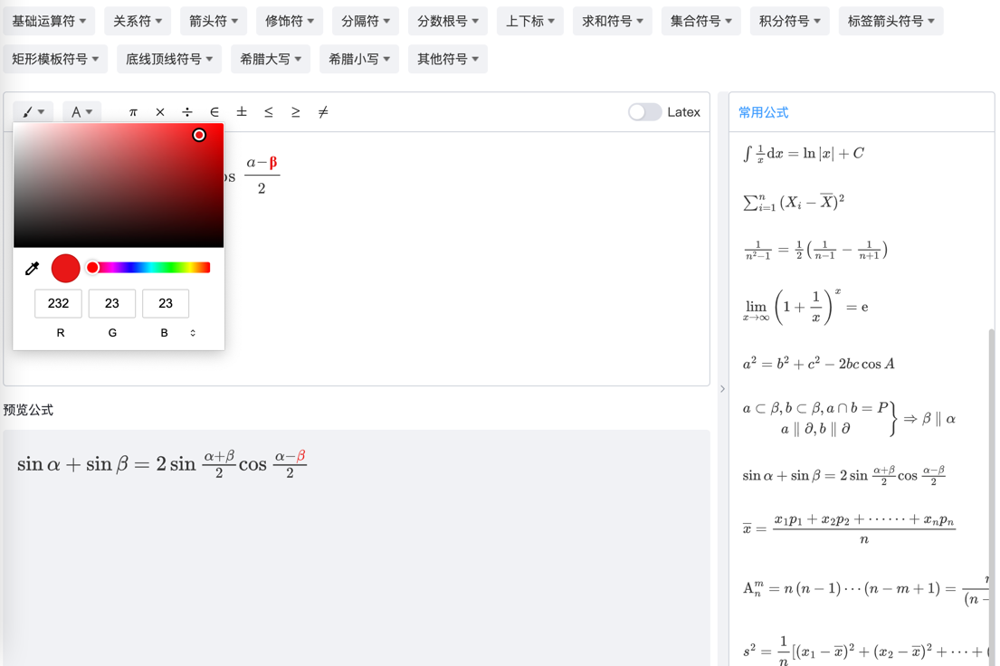

# 可视化数学公式编辑器&latex公式编辑器

> 注意：本项目利用了mathquill.js 实现可视化编辑功能，该库必须要jquery支持，并采用Mathjax3以上版本版本渲染

### 使用方式
> 注意：使用前需要在页面引入

##### 一、引入JS
```javascript
<script src="https://cdn.bootcdn.net/ajax/libs/jquery/1.11.0/jquery.min.js"></script>
<script src="https://cdn.bootcdn.net/ajax/libs/mathjax/3.2.2/es5/tex-svg-full.min.js"></script>
```
上述两个我采用bootcdn，此方式为demo，大家需要自己把js放到自己服务器下，安全一点

##### 二、配置好渲染latex的js配置，目前我采用一MathJax3+，配置如下
```javascript
<script>
        window.MathJax.config = {
            showMathMenu: false,
            showProcessingMessages: false, //关闭js加载过程信息
            messageStyle: 'none', //不显示信息
            extensions: ['tex2jax.js'],
            jax: ['input/TeX', 'input/MathML', 'output/SVG'],
            tex: {
                extensions: [
                    'AMSmath.js',
                    'AMSsymbols.js',
                    'enclose.js'
                ],
                Macros: {
                    RR: ['\\mathbb{R}', 0],
                    f: ['{\\bf #1}', 1],
                    overppprime: ['{{#1}^{\\prime\\prime\\prime}}', 1]
                },
                preview: 'none',
                tags: 'svg',
                inlineMath: [['$', '$'], ['$$', '$$'], ['\\(', '\\)']], //行内公式选择符
                skipTags: ['script', 'noscript', 'style', 'textarea', 'pre', 'code', 'a'], //避开某些标签
            },
            'HTML-CSS': {
                availableFonts: ['STIX', 'TeX'], //可选字体
                showMathMenu: false, //关闭右击菜单显示
                linebreaks: { automatic: true },
                mtextFontInherit: true
            },
            EqnChunkDelay: 100,
            svg: {
                font: 'Tex',
                undefinedFamily: 'songti',
                useFontCache: false,
                useGlobalCache: false,
                linebreaks: {
                    automatic: false,
                    width: 'container'
                },
                EqnChunk: 500,
            },
            displayAlign: 'left',
            messageStyle: 'none',
            skipStartupTypeset: false
        }
    </script>
```

##### 三、引入formula-editor
1. main.js
```javascript
// es
import FormulaEditor from 'formula-editor-plus/es'
import 'formula-editor-plus/dist/es/style.css'
app.use(FormulaEditor);
```
2. 组件中使用
```javascript
import { FormulaEditor } from 'formula-editor-plus/es'
import 'formula-editor-plus/dist/es/style.css'
```

```javascript
<script setup lang="ts">
import toolsLatex from './config/groupConfig.ts'
const formulaRef = ref<ComponentInstance<typeof FormulaEditor> | null>(null)
    
// 获取latex
const getLatex = () => {
  console.log('formulaRef', formulaRef.value?.latexText())
}

// 导出公式为svg
const latexExport = ()=>{
  formulaRef.value?.exportSvg()
}

// 获取latex 为svg代码
const latexSvg = ()=>{
  console.log(formulaRef.value?.svgHtml())
}

// 导出公式为图片
const svgToImage = ()=>{
  formulaRef.value?.svgToImage()
}
</script>

<template>
  <div>
    <FormulaEditor ref="formulaRef" :tools-data="toolsLatex" />
    <button @click="getLatex">获取 latex text代码</button>
    <button @click="latexSvg">获取 latex svg代码</button>
    <button @click="latexExport">导出 latex 为svg</button>
    <button @click="svgToImage">导出 latex 为png</button>
  </div>
</template>
```

##### 方法和属性
类型
```javascript
// 公式
interface DataItem {
    text: string,
    latex: string,
    id: number | string
}

// 顶部菜单说明
interface IListItem {
        id: number | string,
        column: number,
        title: string,
        data: DataItem[]
}
```

参数 | 类型              | 说明 | 默认值
---|-----------------|---|---
latex | String          | 编辑器初始化渲染的latex公式 | ''
commonMath | Array<DataItem> | 右侧常用公式 list | 默认值查看预览效果
toolsData | Array<IListItem> | 顶部菜单公式 list | []
titleTools | Array<DataItem> | 编辑器中title常用latex list | 默认值查看预览效果
latexText() | Function        | 组件实例方法，获取公式的latex代码，ref.latexText()| /
svgHtml() | Function        | 组件实例方法，获取公式的svg代码，ref.svgHtml() | /
exportSvg() | Function        | 组件实例方法，获取公式为svg进行导出，ref.exportSvg() | /
svgToImage() | Function        | 组件实例方法，获取公式为图片进行导出下载，ref.svgToImage() | /
insertLatex(DataItem) | Function        | 组件实例方法，在编辑器光标处插入latex ref.insertLatex() | /


###### 部分预览
1.可视化编辑


2.latex编辑


3.顶部符号


4.字体设置


5.颜色设置

